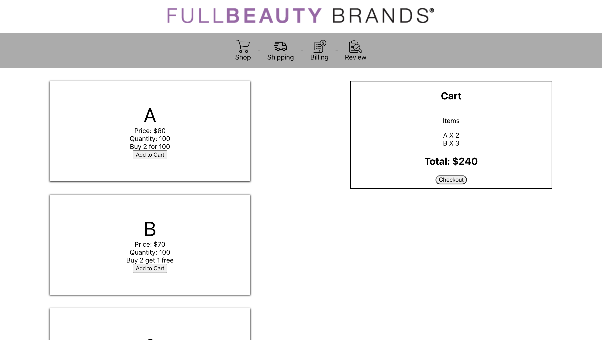

# FullBeauty Brands


Hello to the Team at FBB. First of all thank you so much for the change to interview with you all. Here is my project! As I was working on and off on the weekend I have some questions that were not answered until today. Regarless I changed some stuff today but I kept some of my assumtions, I hope that is okay with every one.

Just a couple of things. At the end of the day I started this project simulating a shopping app so that is what I am going with how that is not too much trouble. I belive a simple funtion that takes an array does not show you I am a full stack engineer. But there are improvements I would've done given the time. Ill discuss them below.

---

### Table of Contents
- [How To Install](#how-to-install)
- [Improvements](#improvements)
- [Info](#info)


---
## How To Install

This is a normal react app, so I will just leave the stuff you should be familiar with.
```
git clone https://github.com/Adrianbarros/fullbeauty-project.git

cd fbb-coding-challenge
npm install 
npm start
```

This will get the App running and on http://localhost:3000/ will be the calculator running.

Here is a look!


## Improvements
Here are a couple of stuff I would improve on given the time.

1. Adding memory

    - I understand having a state maneging everything is not the best or ideal. But given the limited time it was the fastest solution I thought about. I would've added redux or even a json to act as a temporary DB for the project. But I did my best with the time

2. Styling

    - I know it does not look the best but style was sacrificed

3. Routing

    - ofc without memory chnaging paging was going to be hard to I opted for conditional rendering


## Info

Thank you for checking out my project!

Adrian Barros
adriansbarros1@gmail.com
https://www.linkedin.com/in/adrian-s-barros/